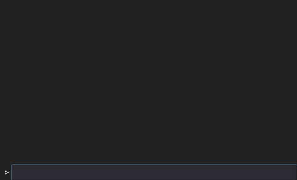

## Installing
1) Clone the whole repository (`git clone git@github.com:WiggleWizard/godot-console.git`) into `project-path/addons`.
2) Enable the addon by going to `Project -> Project Settings -> Plugins` and changing the status of the `Console` addon to `Active`.
3) Drag `res://addons/godot-console/Console.tscn` into your 2D / GUI scene.

## Usage
The Console automatically binds to the *backtick* key on your keyboard. Pressing ` will automatically bring up the console.

### Built in commands
- `help`: Prints out all registered commands alongside their hints.

## Development
### Registering commands
To register commands the `register_command` function is available in a public space.

```gdscript
register_command(command_name, function_reference, hint, help_function_reference);
```

### Printing to the console
The console supports printing to, to do so you can use the `log_raw()` function:
```gdscript
log_raw(string, bbcode=true);
```

### Examples
Here's a `print` example that will print to the console when using the `print` command:

```gdscript
func _ready():
	$Console.register_command("print", funcref(self, "_concmd_print"), "Prints to console");

func _concmd_print(argv):
	$Console.log_raw(argv.join(" "));
```

